<div align="center">
  
</div>

<h1 align="center">Fluxora</h1>

<p align="center">
  <b>Self-hosted hybrid media streaming.</b><br/>
  Movies, TV, music, documents — on every device you own.<br/>
  <i>LAN-fast at home. Seamless over the internet via WebRTC. Open-source. Zero cloud. No tracking.</i>
</p>

<p align="center">
  <a href="https://fluxora.marshalx.dev"></a>
  <a href="LICENSE"></a>
  <a href="docs/10_planning/01_roadmap.md"></a>
  <a href="https://github.com/Marshal-GG/Fluxora-Personal-Streaming-Platform/stargazers"></a>
</p>

<p align="center">
  <a href="https://fluxora.marshalx.dev"><b>Website</b></a> &nbsp;·&nbsp;
  <a href="https://github.com/Marshal-GG/Fluxora-Personal-Streaming-Platform/discussions">Discussions</a> &nbsp;·&nbsp;
  <a href="https://github.com/Marshal-GG/Fluxora-Personal-Streaming-Platform/issues">Issues</a> &nbsp;·&nbsp;
  <a href="docs/">Docs</a>
</p>

<br/>

<h3 align="center">
  <sub></sub>&#160; Why Fluxora
</h3>
<p align="center"></p>

> **Plex meets Syncthing.** Your PC is the server. Your phone, laptop, and TV are the clients. mDNS auto-discovery on LAN; WebRTC P2P falls back to TURN when you're away from home. **No port forwarding, no DDNS, no cloud account.**

<p align="center">
  
  
  
  
  
  
</p>

- **One library, every device.** Movies, TV, music, documents, photos. iOS · Android · Windows · macOS · Linux clients all out of the box.
- **LAN-fast, internet-seamless.** Smart-path picks direct LAN HLS at home and switches to WebRTC P2P when you leave. Zero setup.
- **Owned, encrypted, private.** Your media stays on your hardware. No cloud accounts, no tracking, no ads — ever.
- **Native everywhere.** Flutter desktop and mobile apps; one Python executable for the server. No Electron bloat.
- **Free forever.** The self-hosted server is MIT-licensed. Optional paid tiers fund development without locking the basics.

<br/>

<h3 align="center">
  <sub></sub>&#160; Tech Stack
</h3>
<p align="center"></p>

<p align="center">
  <a href="https://go-skill-icons.vercel.app">
    
  </a>
</p>

| Layer | Tech |
|-------|------|
| **Server** | Python · FastAPI · FFmpeg (HLS) · `aiortc` WebRTC · `aiosqlite` |
| **Database** | SQLite (WAL mode, embedded) — zero external deps |
| **LAN discovery** | Zeroconf / mDNS (`_fluxora._tcp.local`) |
| **Mobile client** | Flutter — Android · iOS |
| **Desktop control panel** | Flutter — Windows · macOS · Linux |
| **Web landing** | Next.js — static export → Cloudflare Pages |
| **Shared Dart logic** | `packages/fluxora_core` (entities, network, design tokens) |
| **Payments** | Polar · Standard Webhooks · INR-priced tiers |

<br/>

<h3 align="center">
  <sub></sub>&#160; Features
</h3>
<p align="center"></p>

<table>
<tr>
<td width="50%" valign="top">

**🏠 LAN streaming**
- mDNS auto-discovery
- HLS adaptive bitrate
- Direct, zero-hop playback
- Sub-second seek

**🌐 Internet streaming**
- WebRTC P2P (no port forwarding)
- STUN / TURN fallback
- E2E-encrypted by default
- Smart path-switching mid-session

</td>
<td width="50%" valign="top">

**📚 Library**
- TMDB metadata + posters
- Auto-organize movies / TV / music
- Multi-folder watch
- Manual identification override

**🔐 Security**
- Bearer tokens stored as HMAC-SHA256
- Fernet-encrypted secrets at rest
- Per-client revocation
- No analytics, no telemetry

</td>
</tr>
</table>

<br/>

<h3 align="center">
  <sub></sub>&#160; Quick Start
</h3>
<p align="center"></p>

<details open>
<summary><b>Server</b></summary>

```bash
cd apps/server
pip install -e .[dev]
uvicorn main:app --reload --host 0.0.0.0 --port 8080
```

Requires `TOKEN_HMAC_KEY` in `%APPDATA%\Fluxora\.env` (Windows) or `~/.fluxora/.env` (macOS / Linux).

</details>

<details>
<summary><b>Mobile (Flutter)</b></summary>

```bash
cd apps/mobile
flutter pub get
flutter run
```

</details>

<details>
<summary><b>Desktop control panel (Flutter)</b></summary>

```bash
cd apps/desktop
flutter pub get
flutter run -d windows   # or macos / linux
```

</details>

<details>
<summary><b>Web landing (Next.js)</b></summary>

```bash
cd apps/web_landing
npm install
npm run dev
```

</details>

<br/>

<h3 align="center">
  <sub></sub>&#160; Pricing
</h3>
<p align="center"></p>

| Tier | Price | What's included |
|------|-------|-----------------|
| **Free** | ₹0 / forever | Full self-hosted server · all clients · LAN streaming · TMDB metadata |
| **Plus** | ₹99 / mo | Internet streaming over WebRTC · 3 simultaneous remote streams · mobile offline downloads |
| **Pro** ⭐ | ₹199 / mo | Hardware transcoding · 10 simultaneous remote streams · client groups · priority support |
| **Ultimate** | ₹4,499 once | Lifetime access · unlimited streams · early-access beta features |

<p align="center"><i>Cancel anytime. Server keeps running.</i> &nbsp;→&nbsp; <a href="https://fluxora.marshalx.dev/#pricing"><b>Full feature matrix</b></a></p>

<br/>

<h3 align="center">
  <sub></sub>&#160; Status
</h3>
<p align="center"></p>

<p align="center">
  
  
  
  
  
</p>

Phases 1–4 shipped. **Phase 5 — advanced features + brand redesign** is in progress.

→ Live status in the **[roadmap](docs/10_planning/01_roadmap.md)**.

<br/>

<h3 align="center">
  <sub></sub>&#160; Docs
</h3>
<p align="center"></p>

- 🌐 **[fluxora.marshalx.dev](https://fluxora.marshalx.dev)** — marketing site + downloads
- 🎯 **[Vision & Differentiators](docs/01_product/01_vision.md)**
- 🏗 **[System Architecture](docs/02_architecture/01_system_overview.md)**
- 🎨 **[Design System](DESIGN.md)**
- 📍 **[Roadmap](docs/10_planning/01_roadmap.md)**
- 🔌 **[API Contracts](docs/04_api/01_api_contracts.md)**
- 🔒 **[Privacy](https://fluxora.marshalx.dev/privacy/)** · **[Terms](https://fluxora.marshalx.dev/terms/)**

<br/>

## License

[MIT](LICENSE) — use it, fork it, build a service on top of it. Paid tiers fund continued development; they don't lock the basics.

<br/>

<p align="center">
  
</p>

<p align="center">
  <sub>Made with 💜 by <a href="https://github.com/Marshal-GG"><b>Marshal-GG</b></a> · Stream. Sync. Anywhere.</sub>
</p>
