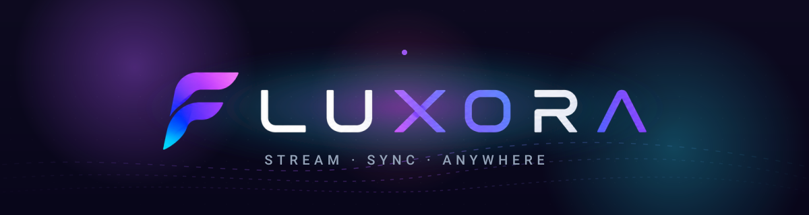

  

<h1 align="center">Fluxora</h1>

  <b>Self-hosted hybrid media streaming.</b> 
  Movies, TV, music, documents — on every device you own. 
  <i>LAN-fast at home. Seamless over the internet via WebRTC. Your hardware. No phone-home. No tracking.</i>

  
  
  

  <a href="https://fluxora.marshalx.dev"><b>Website</b></a> &nbsp;·&nbsp;
  <a href="https://fluxora.marshalx.dev/#download">Download</a> &nbsp;·&nbsp;
  <a href="https://fluxora.marshalx.dev/#pricing">Pricing</a> &nbsp;·&nbsp;
  <a href="https://github.com/Marshal-GG/Fluxora-Personal-Streaming-Platform/discussions">Discussions</a> &nbsp;·&nbsp;
  <a href="https://github.com/Marshal-GG/Fluxora-Personal-Streaming-Platform/issues">Issues</a>

 

<h3 align="center">
  &#160; Why Fluxora
</h3>

> **Plex meets Syncthing.** Your PC is the server. Your phone, laptop, and TV are the clients. mDNS auto-discovery on LAN; WebRTC P2P falls back to TURN when you're away from home. **No port forwarding, no DDNS, no cloud account.**

  
  
  
  
  
  

- **One library, every device.** Movies, TV, music, documents, photos. iOS · Android · Windows · macOS · Linux clients all out of the box.
- **LAN-fast, internet-seamless.** Smart-path picks direct LAN HLS at home and switches to WebRTC P2P when you leave. Zero setup.
- **Owned, encrypted, private.** Your media stays on your hardware. No cloud accounts, no ads, no data resale — ever. The binary makes no silent telemetry calls; verify with Wireshark. Any future opt-in features that touch your data will be documented in [EULA §5.4](EULA.md) and default to off.
- **Native everywhere.** Native mobile + desktop apps; one native server binary. No Electron, no Docker required, no JVM, no external database.
- **Free tier, forever.** Download the server, run it on your hardware. LAN streaming works out of the box. Paid tiers unlock concurrent-stream slots, internet streaming, and hardware transcoding by activating a license key on the server.

 

<h3 align="center">
  &#160; Features
</h3>

<table>
<tr>
<td width="50%" valign="top">

**🏠 LAN streaming**
- mDNS auto-discovery
- HLS adaptive bitrate
- Direct, zero-hop playback
- Sub-second seek

**🌐 Internet streaming** *(Plus+)*
- WebRTC P2P (no port forwarding)
- STUN / TURN fallback
- E2E-encrypted by default
- Smart path-switching mid-session

</td>
<td width="50%" valign="top">

**📚 Library**
- TMDB metadata + posters
- Auto-organise movies / TV / music
- Multi-folder watch
- Manual identification override

**🔐 Security**
- Bearer tokens stored as HMAC-SHA256 hashes
- Fernet-encrypted secrets at rest
- Per-client revocation
- No silent telemetry · no phone-home today; any future opt-in features documented in EULA §5.4 + default-off

</td>
</tr>
</table>

 

<h3 align="center">
  &#160; Pricing
</h3>

| Tier | Price | What's included |
|------|-------|-----------------|
| **Free** | ₹0 / forever | Self-hosted server · all clients · LAN streaming · TMDB metadata · low concurrent-stream cap |
| **Plus** | ₹99 / mo | Everything in Free · internet streaming over WebRTC · **3 concurrent streams** · mobile offline downloads |
| **Pro** ⭐ | ₹199 / mo | Everything in Plus · hardware transcoding · **10 concurrent streams** · client groups · priority support |
| **Ultimate** | ₹4,499 once | Everything in Pro · **unlimited concurrent streams** · lifetime key · early-access beta features |

<b>One license. One server. Unlimited paired devices — pay for concurrent streams, not for seats.</b>

<i>Cancel anytime. Server keeps running on the Free tier.</i> &nbsp;→&nbsp; <a href="https://fluxora.marshalx.dev/#pricing"><b>Full feature matrix</b></a>

 

<h3 align="center">
  &#160; Get started
</h3>

  <a href="https://fluxora.marshalx.dev/#download"><b>↓ Download Fluxora</b></a>

1. **Install the server** on the machine that holds your media library (Windows / macOS / Linux).
2. **Install the client app** on your phones, tablets, laptops, and TVs (iOS · Android · Windows · macOS · Linux).
3. **Open the client on your home Wi-Fi.** It auto-discovers the server via mDNS — tap **Pair**.
4. **Approve the pairing** from the server's Desktop Control Panel.
5. **Stream.** That's it. Internet streaming, hardware transcoding, and bigger stream caps unlock when you activate a license key.

Full setup walk-through, screenshots, and per-platform install notes: **[fluxora.marshalx.dev](https://fluxora.marshalx.dev)**.

 

<h3 align="center">
  &#160; Links
</h3>

- 🌐 **[fluxora.marshalx.dev](https://fluxora.marshalx.dev)** — marketing site + downloads
- 📜 **[EULA](EULA.md)** · **[Terms](TERMS.md)** · **[Privacy](PRIVACY.md)** · **[Security](SECURITY.md)** · **[Notice](NOTICE)**
- 💬 **[Discussions](https://github.com/Marshal-GG/Fluxora-Personal-Streaming-Platform/discussions)** — Q&A, feature requests
- 🐛 **[Issues](https://github.com/Marshal-GG/Fluxora-Personal-Streaming-Platform/issues)** — bug reports (rendered binary, not source)
- 🛡 **`security@fluxora.marshalx.dev`** — vulnerability disclosure

 

## License

Fluxora is **proprietary software**. The source code is not distributed.

- The **server binary** is governed by [`EULA.md`](EULA.md).
- The **mobile + desktop client apps** are free downloads governed by the same EULA.
- **One license activates one server**; an unlimited number of devices may pair with that server. Tier limits the number of *simultaneous streams*, not the number of paired devices.
- License keys are **HMAC-signed and self-validating** — no phone-home, no upstream check after the initial Polar redemption. Verify with Wireshark.

For licensing inquiries: `legal@fluxora.marshalx.dev`.

 

  

  Made with 💜 by <a href="https://github.com/Marshal-GG"><b>Marshal-GG</b></a> · Stream. Sync. Anywhere.

