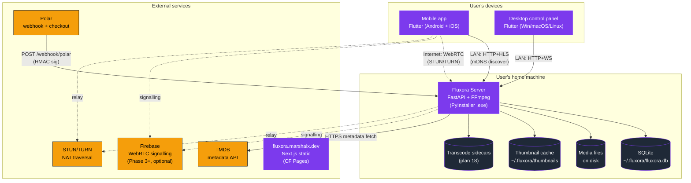
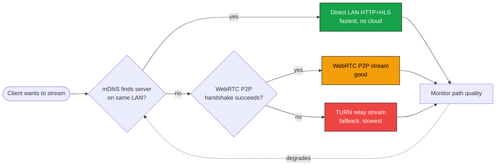

# 01 — System Landscape

> Top-level view of every Fluxora component and how they connect. Start here.

---

## The whole system, one diagram

---

## Connection paths — LAN vs Internet

---

## Data ownership

| Where it lives | What it holds |
|---|---|
| **`~/.fluxora/fluxora.db`** (server) | All library metadata, clients, sessions, settings, notifications, activity, transcode jobs, group access rules |
| **`~/.fluxora/thumbnails/`** (server) | Generated JPEG thumbnails for video / image / audio-art / PDF |
| **`~/.fluxora/transcoded/`** (server, opt-in path) | AV1/VP9 → H.264 sidecar files (plan 18) |
| **flutter_secure_storage** (each client) | Bearer token only — no library data |
| **No cloud** | The library catalogue. Ever. |
| **Firebase** (Phase 3+, optional) | Only WebRTC signalling messages — ephemeral, no media bytes |

---

## What is *out of scope*

- Multi-tenant cloud sync — v2 deferred (see [user-memory `project_v2_deferred`](../../../../../../../C:/Users/marsh/.claude/projects/f--AI-Models-Projects-Fluxora/memory/project_v2_deferred.md))
- Browser-based streaming client
- Subtitle / caption rendering (Phase 3+)
- AI recommendations (Phase 5)

See [system_overview.md](../01_system_overview.md) for prose-level architecture detail.
