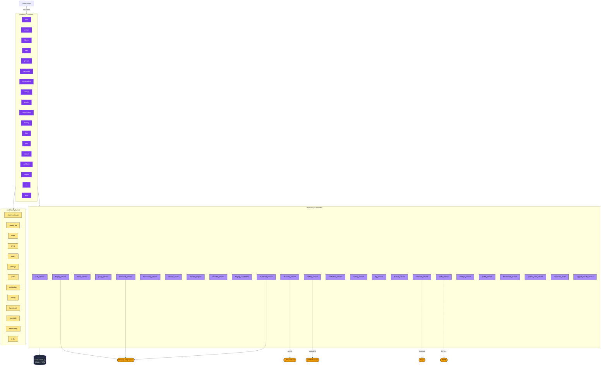
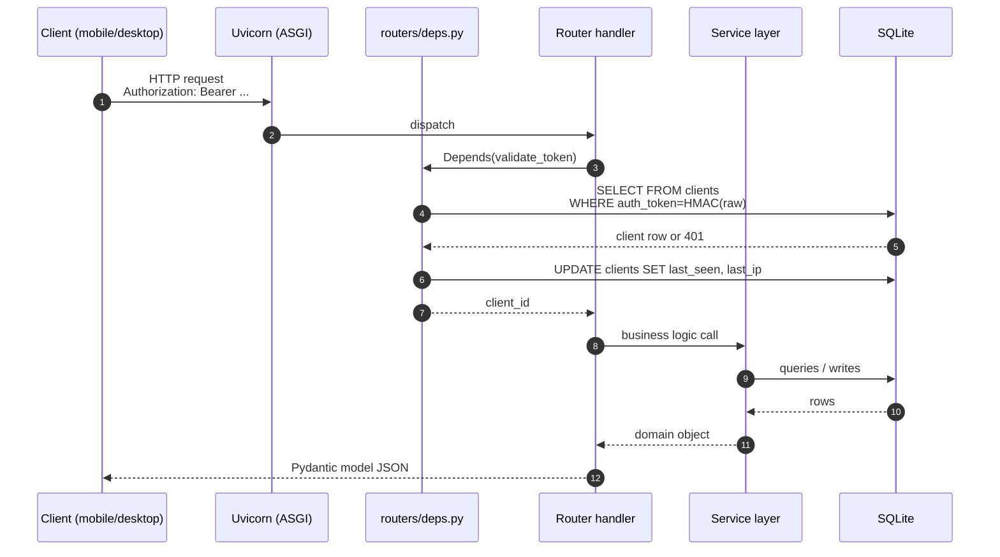
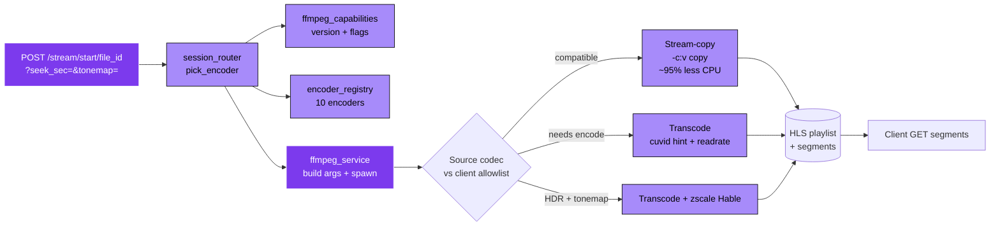

# 02 — Server Architecture

> Python FastAPI backend at `apps/server/`. Single-process, async, SQLite-backed.

---

## Layer view

---

## Request flow — typical authenticated endpoint

---

## Streaming-specific subsystem

---

## Background workers

| Worker | Source file | Trigger | What it does |
|---|---|---|---|
| Thumbnail worker | `services/thumbnail_worker.py` | `media_thumbnails` rows where status=pending | FFmpeg / PyMuPDF extract; concurrency=4 |
| Transcode worker | `services/transcode_service.py` | `transcode_jobs` queue rows | Single-worker FIFO; AV1/VP9 → H.264 sidecars |
| TMDB enrichment | `services/library_service.py` | After scan finds an unenriched file | Best-effort title/poster fetch |
| Activity emitter | `services/activity_service.py` | Every mutating router call | Records `activity_events` row |
| Notification fan-out | `services/notification_service.py` | Persistent notif written | WS broadcast to `/ws/notifications` subscribers |
| Event fan-out | `notification_service.broadcast_event` | After library/storage mutations | Ephemeral `{kind:"library_changed"}` over same WS |
| Discovery | `services/discovery_service.py` | App startup | Zeroconf service registration on LAN |
| System stats | `services/system_stats_service.py` | WS `/ws/stats` subscriber | CPU / RAM / network samples |
| Log pubsub | `services/log_service.py` | Every log line written | Fan out to `/ws/logs` |

---

## Hard prohibitions enforced in code

| Rule | Where it's enforced |
|---|---|
| No `print()` — use `logger` | Module-level `logger = logging.getLogger(__name__)` in every file |
| No silent excepts | Every `except` logs + re-raises or handles explicitly |
| Bearer tokens stored as HMAC-SHA256 | `services/auth_service.py` |
| API keys / TMDB key via `BaseSettings` | `config.py` — no magic strings |
| Migrations append-only | `database/migrations/` — never edit past files |
| Parameterised SQL only | All queries use `?` placeholders |
| No PII in logs | `support_bundle_service.py` scrubs before bundling |

See [CLAUDE.md → Hard Prohibitions](../../../CLAUDE.md).
