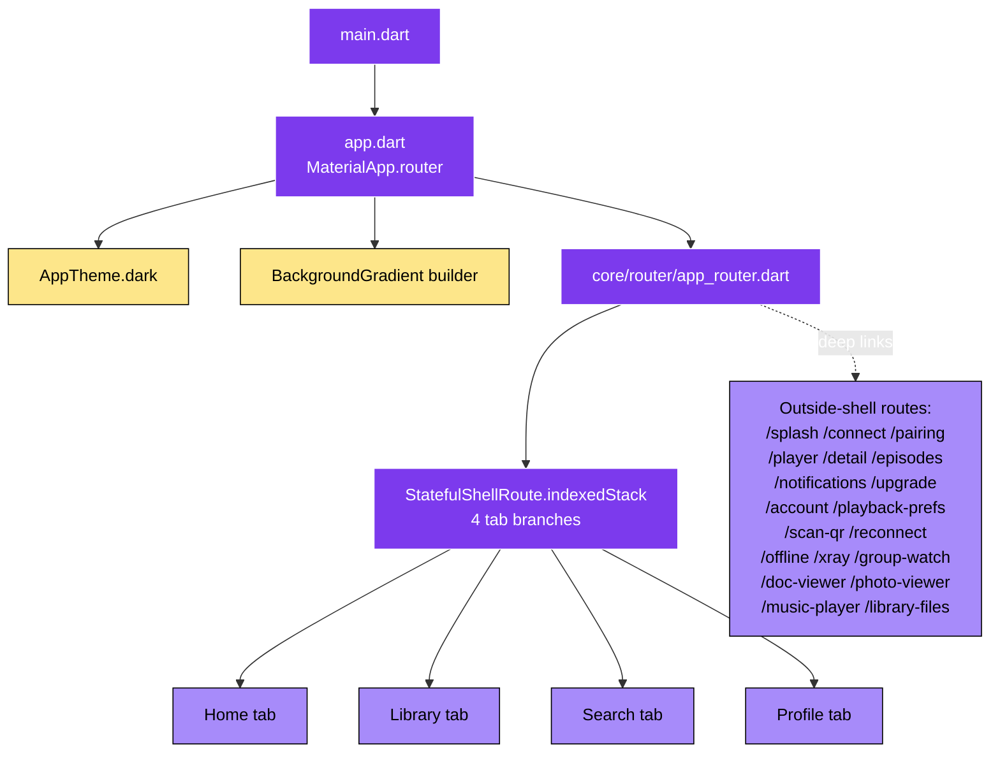
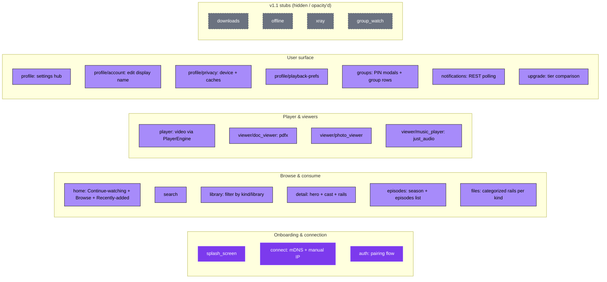
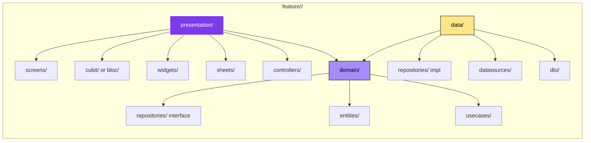
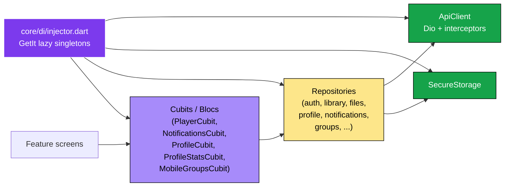
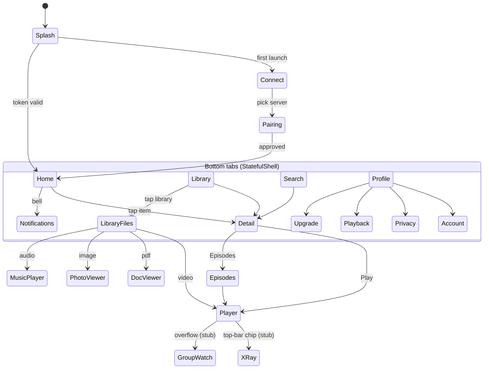
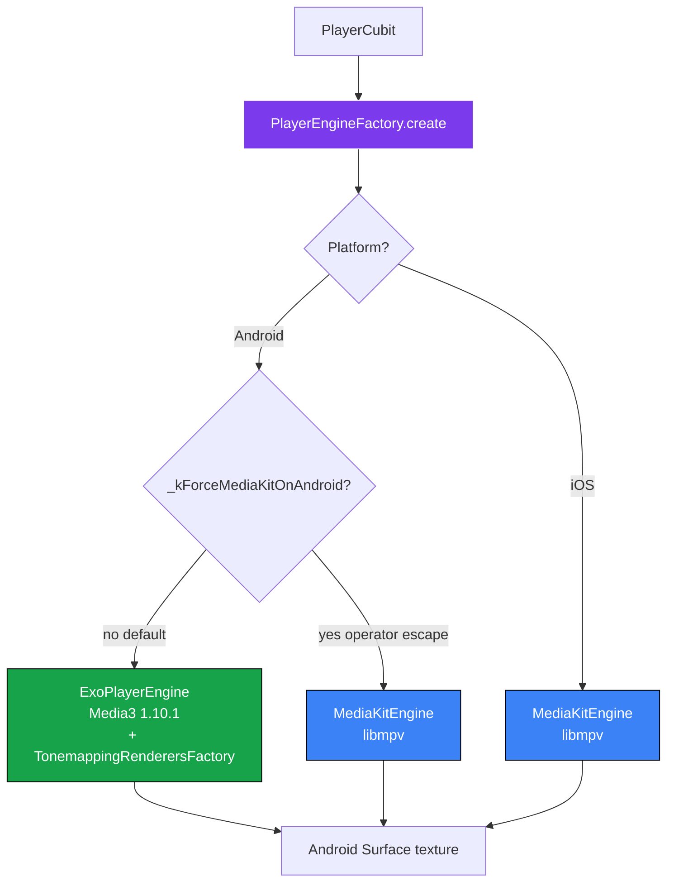

# 03 — Mobile Architecture

> Flutter app at `apps/mobile/`. Android + iOS. Talks to `packages/fluxora_core` for shared code.

---

## App skeleton — entry to first frame

---

## Feature modules (Clean Architecture per feature)

---

## Per-feature internal structure (Clean Architecture)

**Rule:** presentation depends on domain. data implements domain. domain depends on nothing.

---

## State + dependency injection

`ApiClient`, `SecureStorage`, and most repositories live in `packages/fluxora_core`. See [05_shared_core.md](05_shared_core.md).

---

## Navigation map — visible tabs + key deep links

---

## Player engine selection (mobile-side)

See [10_player_engines.md](10_player_engines.md) for the full class diagram.

---

## Mobile-only direct deps (key ones)

| Package | Purpose |
|---|---|
| `media_kit` | libmpv-based player (desktop + iOS + Android-rollback) |
| `pdfx` | PDF viewer |
| `photo_view` | Pinch-zoom images |
| `just_audio` + `audio_service` | Audio playback + lockscreen |
| `mobile_scanner` | QR pairing |
| `screen_brightness` | Player brightness gesture |
| `connectivity_plus` | Wi-Fi-only streaming gate |
| `cached_network_image` | Thumbnail/poster cache |
| `share_plus` | Share-sheet for "other" file kinds |
| `lucide_icons_flutter` | Icon set |
| `google_fonts` | Typography |

Everything cross-platform lives in `packages/fluxora_core` — see [05_shared_core.md](05_shared_core.md).
