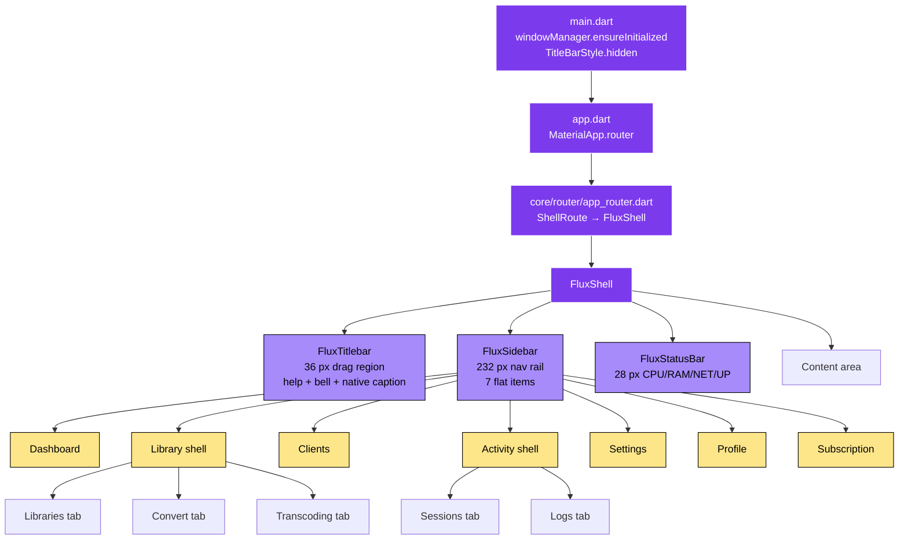
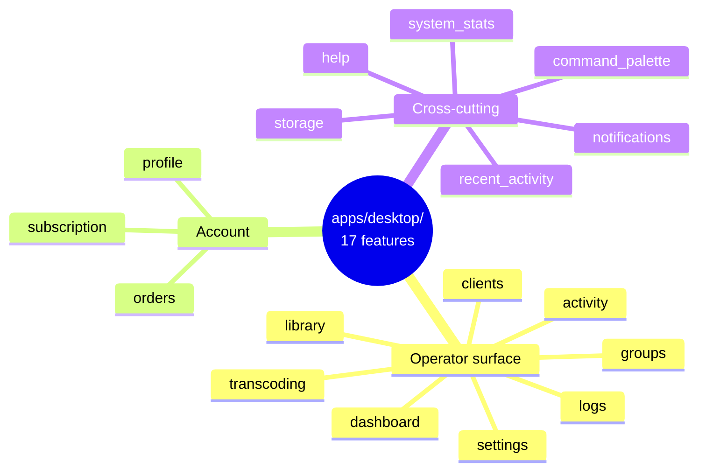
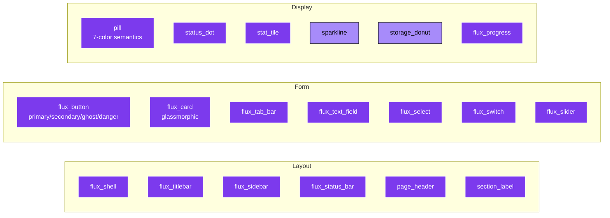
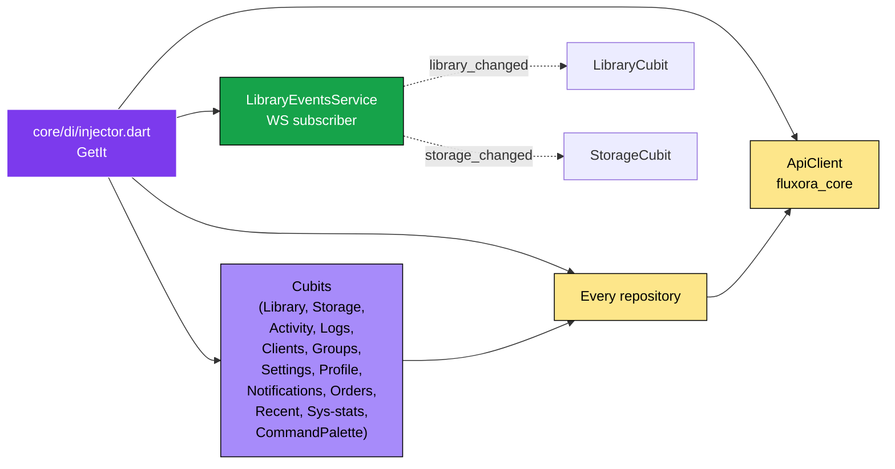
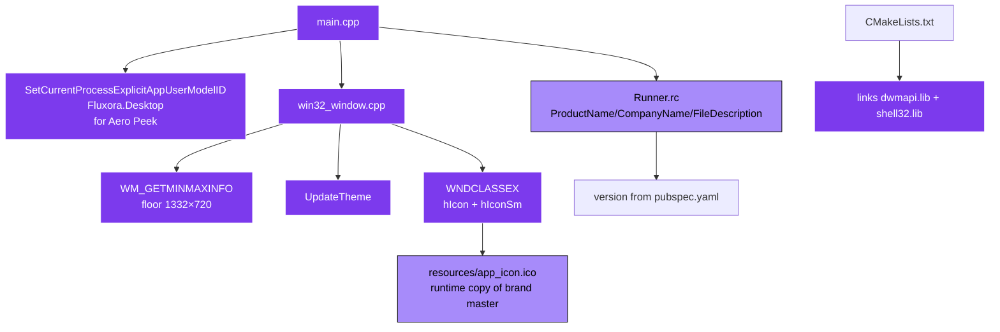

# 04 — Desktop Architecture

> Flutter desktop control panel at `apps/desktop/`. Windows / macOS / Linux. Used by the **operator** (server admin), not end users.

---

## Shell + IA (post plan 26 redesign)

---

## Feature inventory

---

## Shared widget primitives (V2)

All primitives are previewable at the `/showcase` dev route.

---

## State + DI

`LibraryEventsService` listens on `/api/v1/ws/notifications` and demuxes ephemeral `{type:"event"}` frames into broadcast streams that the Library and Storage cubits subscribe to — replaced 15 s polling timers at plan 26 refinement (2026-05-16).

---

## Frameless window — Windows runner

---

## Test surface

| Area | Count (as of 2026-05-09) | Notes |
|---|---|---|
| Unit + bloc tests | 104 | `apps/desktop/test/features/` |
| Golden tests | Dashboard | Opt-in via `--tags=golden`; GetIt-mock recipe in `test/goldens/_README.md` |
| Folder browser cubit | +16 (plan 28) | history + folder-size cache + sort/view/search |

Total trending ~137 as of plan 28 Phase D ship.

---

## Connecting to the server

The desktop control panel is **always-local-operator** — it talks to `http://localhost:8000` (or whatever port the server is on). It does **not** use the LAN/WebRTC smart-switching logic the mobile app uses — there's no need; it's on the same machine.

Auth: bearer token from initial pair (or local-bypass when running on same host — see `validate_token_or_local` in `routers/deps.py`).

---

## Where to find planning history

- Plan 26 — IA redesign + Library shell + Activity shell (active)
- Plan 28 — Folder browser power features (archived 2026-05-16)
- Plan 27 — Per-file thumbnail generation (active)

See [`docs/10_planning/`](../../10_planning/) for the full set.
