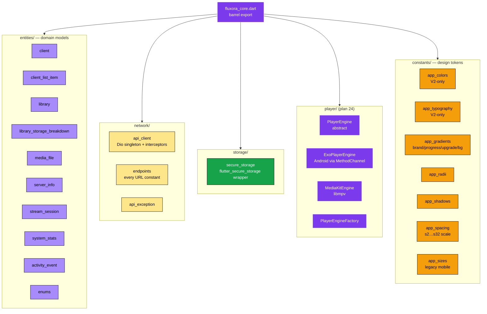
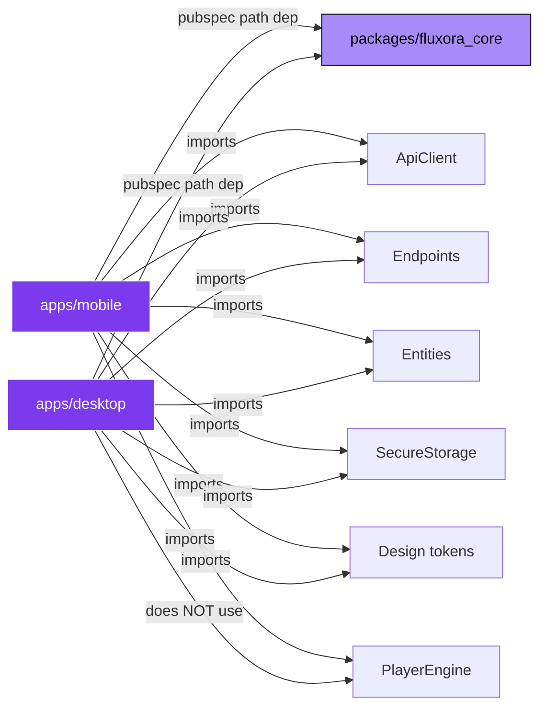
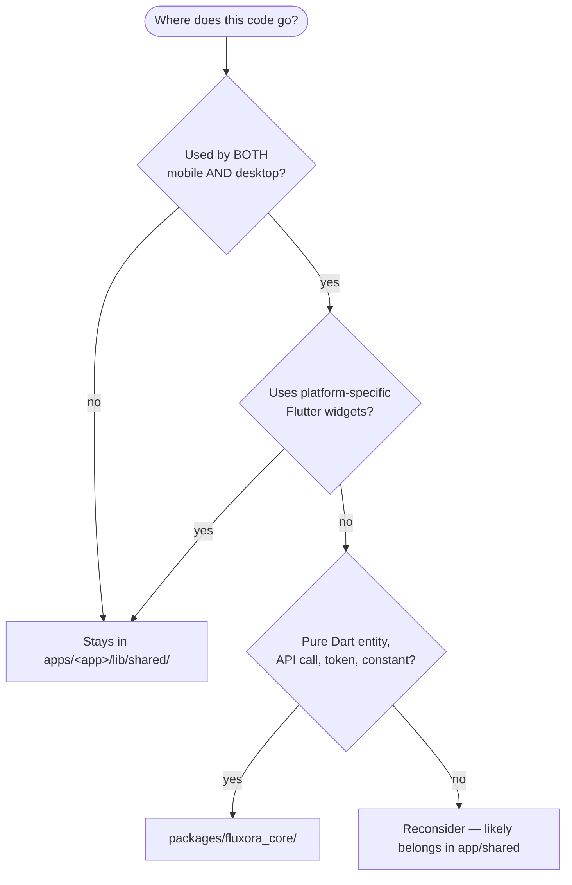
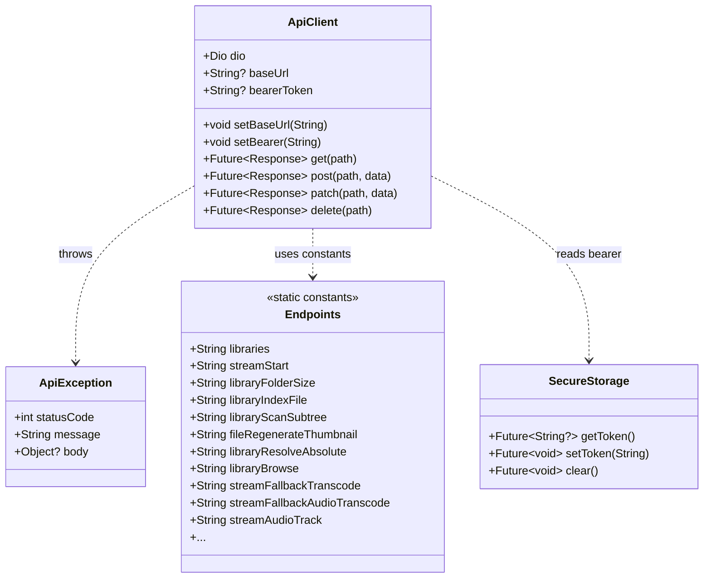

# 05 — Shared Core

> `packages/fluxora_core` — every line of code shared between **mobile** and **desktop**. No platform-specific widgets. Imported via local path dependency.

---

## Package contents



---

## Who imports what



Desktop doesn't import `PlayerEngine` — control panel has no media playback surface.

---

## What goes in `fluxora_core` vs what stays in the app



> Rule of thumb: **if you can't use it without `flutter/material.dart`, it stays out of `fluxora_core`.** The package keeps a clean Flutter-agnostic core.

---

## API client + endpoint pattern



---

## Brand assets — runtime copies

The package also carries runtime copies of brand assets that mobile/desktop pick up:

```
packages/fluxora_core/assets/brand/
├── fluxora_mark.png       # The mark glyph
├── fluxora_wordmark.png   # Wordmark
└── app_icon.ico           # Windows runner icon (also copied to apps/desktop/windows/runner/resources/)
```

The canonical masters live in `/assets/brand/` at the repo root. These are **synced derivatives** — see [`assets/README.md`](../../../assets/README.md) for the sync flow.

---

## Tests for fluxora_core

Currently `packages/fluxora_core/` has no test directory of its own — entities and ApiClient are exercised through the mobile and desktop tests that import them. If you add complex logic here, give it a `test/` directory.
