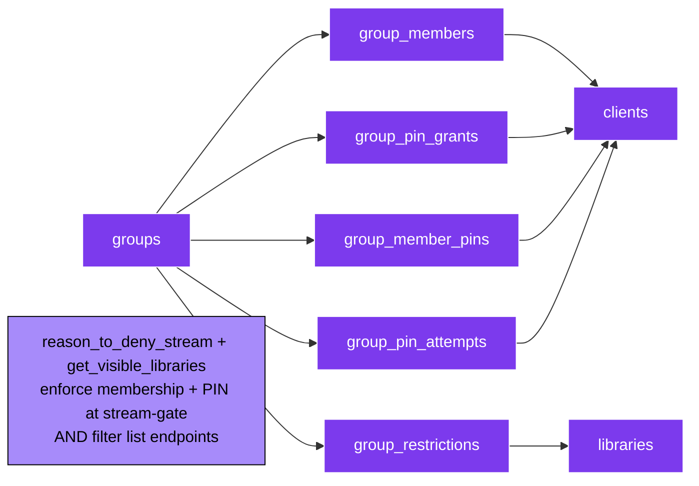
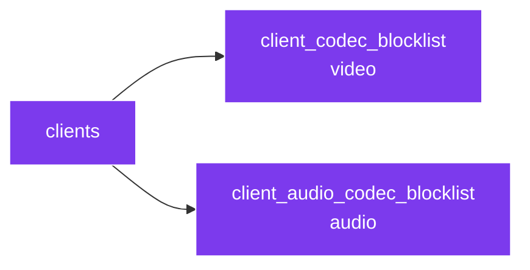
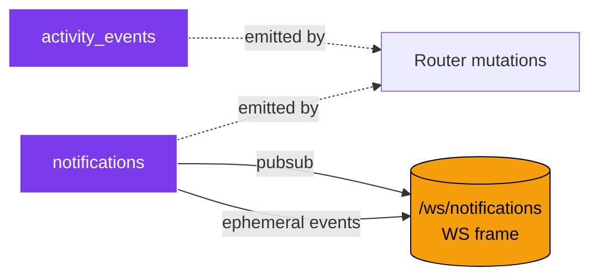
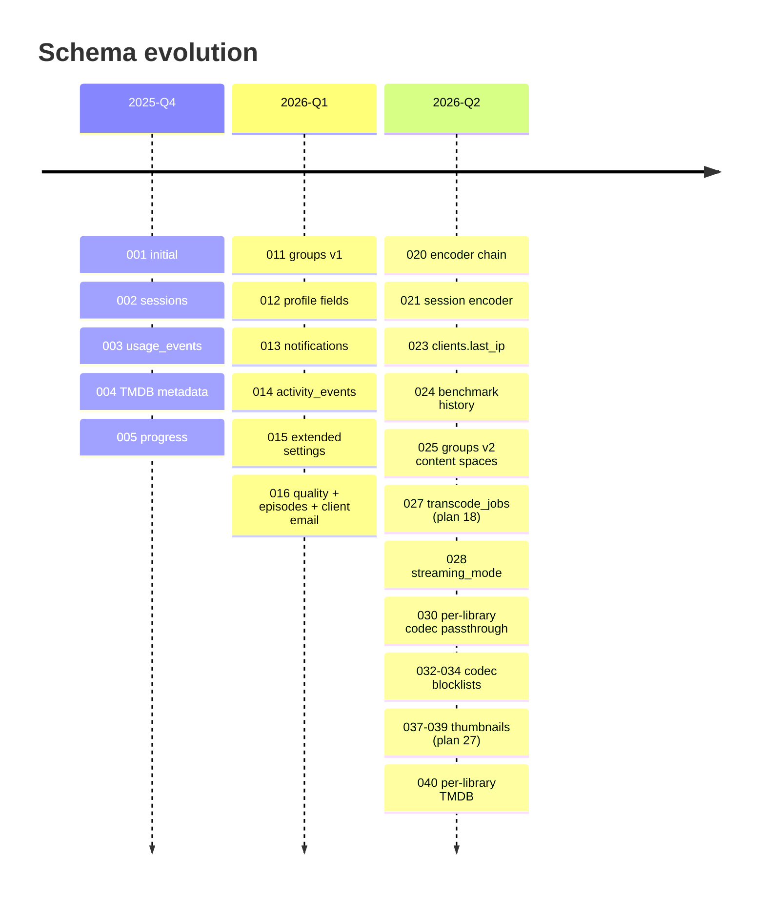

# 06 — Data Model (SQLite ER)

> Every table in `~/.fluxora/fluxora.db`. WAL mode, single-process. Migrations live at `apps/server/database/migrations/` and are append-only.

See [`docs/03_data/02_database_schema.md`](../../03_data/02_database_schema.md) for column-level detail.

---

## Whole schema

```mermaid
erDiagram
  libraries ||--o{ media_files : "contains"
  libraries ||--o{ group_restrictions : "scoped by"
  media_files ||--o{ stream_sessions : "streamed in"
  media_files ||--o| media_thumbnails : "has"
  media_files ||--o{ transcode_jobs : "queued for"
  clients ||--o{ stream_sessions : "owns"
  clients ||--o{ group_members : "joins"
  clients ||--o{ client_codec_blocklist : "video blocklist"
  clients ||--o{ client_audio_codec_blocklist : "audio blocklist"
  clients ||--o{ group_pin_grants : "PIN grants"
  clients ||--o{ group_pin_attempts : "PIN attempts"
  clients ||--o{ group_member_pins : "per-client PIN"
  groups ||--o{ group_members : "membership"
  groups ||--o{ group_restrictions : "library access"
  groups ||--o{ group_pin_grants : "PIN grants"
  groups ||--o{ group_pin_attempts : "PIN attempts"
  groups ||--o{ group_member_pins : "per-client PINs"

  libraries {
    TEXT id PK
    TEXT name
    TEXT type "movies/tv/music/files"
    TEXT root_paths "JSON array"
    TIMESTAMP last_scanned
    INTEGER av1_stream_copy_override "tri-state"
    INTEGER vp9_stream_copy_override "tri-state"
    INTEGER tmdb_enabled
  }

  media_files {
    TEXT id PK
    TEXT path UK
    TEXT name
    TEXT extension
    INTEGER size_bytes
    REAL duration_sec
    TEXT library_id FK
    INTEGER tmdb_id
    TEXT title
    TEXT overview
    TEXT poster_url
    REAL last_progress_sec
    INTEGER width
    INTEGER height
    TEXT codec_name
    TEXT hdr_format "HDR10/HLG/DolbyVision/NULL"
    INTEGER tmdb_show_id
    INTEGER season_number
    INTEGER episode_number
    TEXT transcoded_path "plan 18 sidecar"
    INTEGER transcoded_size
    TIMESTAMP transcoded_at
    REAL transcoded_source_mtime
    TEXT audio_tracks "plan 22 JSON"
  }

  clients {
    TEXT id PK
    TEXT name
    TEXT platform "android/ios/win/mac/linux"
    TIMESTAMP last_seen
    BOOLEAN is_trusted
    TEXT auth_token "HMAC-SHA256 hash"
    TEXT status "pending/approved/rejected"
    TEXT email
    TEXT paired_at
    TEXT last_ip
  }

  stream_sessions {
    TEXT id PK
    TEXT file_id FK
    TEXT client_id FK
    TIMESTAMP started_at
    TIMESTAMP ended_at
    TEXT connection_type "lan/webrtc_p2p/turn_relay"
    INTEGER bytes_transferred
    REAL progress_sec
    TEXT encoder_used
  }

  media_thumbnails {
    TEXT file_id PK_FK
    TEXT status "pending/generating/ready/failed/stale"
    INTEGER priority "10 boosted, 5 default"
    INTEGER attempts
    TEXT error_message
    TIMESTAMP generated_at
    TIMESTAMP created_at
    TIMESTAMP updated_at
  }

  transcode_jobs {
    TEXT id PK
    TEXT file_id FK
    TEXT status "queued/running/done/failed/cancelled"
    INTEGER attempts
    TEXT error_message
    TIMESTAMP created_at
    TIMESTAMP started_at
    TIMESTAMP finished_at
  }

  groups {
    TEXT id PK
    TEXT name
    TEXT description
    INTEGER is_public "v2 manufactured Public"
    TEXT icon
    TEXT color
    INTEGER requires_pin
    TEXT pin_hash
    TEXT pin_mode "off/shared/per_client"
    INTEGER max_concurrent_streams
    TIMESTAMP created_at
  }

  group_members {
    TEXT group_id FK
    TEXT client_id FK
    TIMESTAMP joined_at
    TEXT time_window_override "JSON"
  }

  group_restrictions {
    TEXT group_id FK
    TEXT library_id FK
  }

  group_pin_grants {
    TEXT id PK
    TEXT group_id FK
    TEXT client_id FK
    TIMESTAMP granted_at
    TIMESTAMP expires_at
  }

  group_pin_attempts {
    TEXT id PK
    TEXT group_id FK
    TEXT client_id FK
    TIMESTAMP attempted_at
    INTEGER success
  }

  group_member_pins {
    TEXT group_id FK
    TEXT client_id FK
    TEXT pin_hash
    TIMESTAMP enrolled_at
  }

  client_codec_blocklist {
    TEXT client_id FK
    TEXT codec
    TIMESTAMP recorded_at
  }

  client_audio_codec_blocklist {
    TEXT client_id FK
    TEXT codec
    TIMESTAMP recorded_at
  }

  notifications {
    TEXT id PK
    TEXT type "info/success/warning/error"
    TEXT category "general/pairing/scan/thumbnail/..."
    TEXT title
    TEXT body
    TIMESTAMP created_at
    TIMESTAMP read_at
    TIMESTAMP dismissed_at
  }

  activity_events {
    TEXT id PK
    TEXT type "library.scanned/client.paired/..."
    TEXT summary
    TEXT payload "JSON"
    TIMESTAMP created_at
  }

  benchmark_runs {
    TEXT id PK
    TEXT encoder
    REAL fps
    REAL cpu_pct
    TIMESTAMP started_at
    TIMESTAMP finished_at
  }

  polar_orders {
    TEXT id PK
    TEXT event_id UK "idempotency"
    TEXT customer_email
    TEXT product
    INTEGER amount_cents
    TEXT currency
    TIMESTAMP created_at
  }

  user_settings {
    INTEGER id PK "always 1"
    TEXT server_name
    BOOLEAN transcoding_enabled
    INTEGER max_concurrent_streams
    TEXT subscription_tier "free/plus/pro/ultimate"
    TEXT tmdb_api_key
    TEXT license_key
    TEXT transcoding_encoder
    TEXT transcoding_preset
    INTEGER transcoding_crf
    TEXT transcoding_chain "JSON list"
    TEXT transcoding_hwaccel_device
    TEXT display_name
    TEXT email
    TEXT avatar_path
    TIMESTAMP profile_created_at
    TIMESTAMP last_login_at
    TEXT streaming_mode "auto/client_decode/server_transcode"
    TEXT transcode_storage_mode
    TEXT transcode_cache_root
    INTEGER thumbnail_width "160-640"
  }
```

> `user_settings` is a **singleton** — always exactly one row (id=1). Holds operator preferences + license state + transcoder defaults.

---

## Cross-cutting relationship groups

### Library access (Groups v2)



The Public group is **manufactured** by migration 025 — every approved client auto-joins it, and library backfill makes the v1 default behaviour identical for un-grouped libraries.

### Codec blocklists (plans 20 + 21)



When a client reports a stream-copy attempt failed, the codec gets added to its blocklist — next start request from the same client skips that codec and goes straight to transcode (or to audio-only fallback for audio mismatches).

### Activity + Notifications



Notifications double as the carrier for ephemeral events (`library_changed` / `storage_changed`) — same socket, different frame shape — which lets desktop cubits refresh without polling. See [02_server_architecture.md](02_server_architecture.md).

---

## Migration timeline (high level)



For column-level history, see [`docs/03_data/02_database_schema.md`](../../03_data/02_database_schema.md) and [`docs/03_data/04_migration_guide.md`](../../03_data/04_migration_guide.md).
