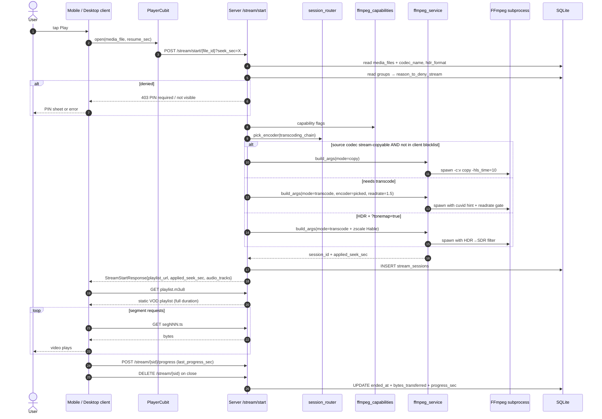
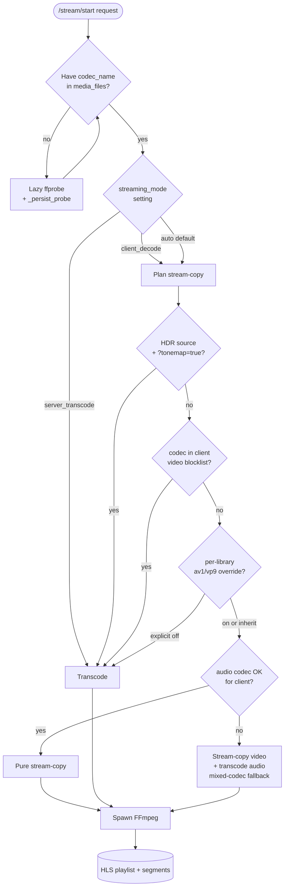
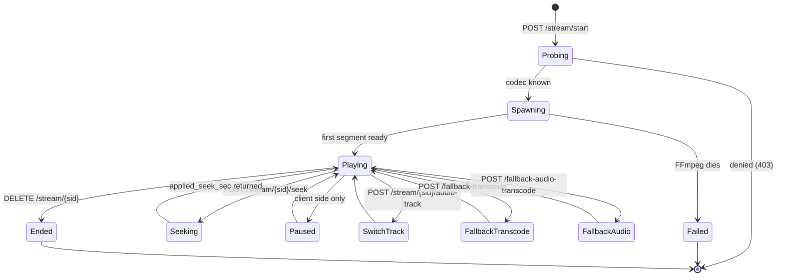
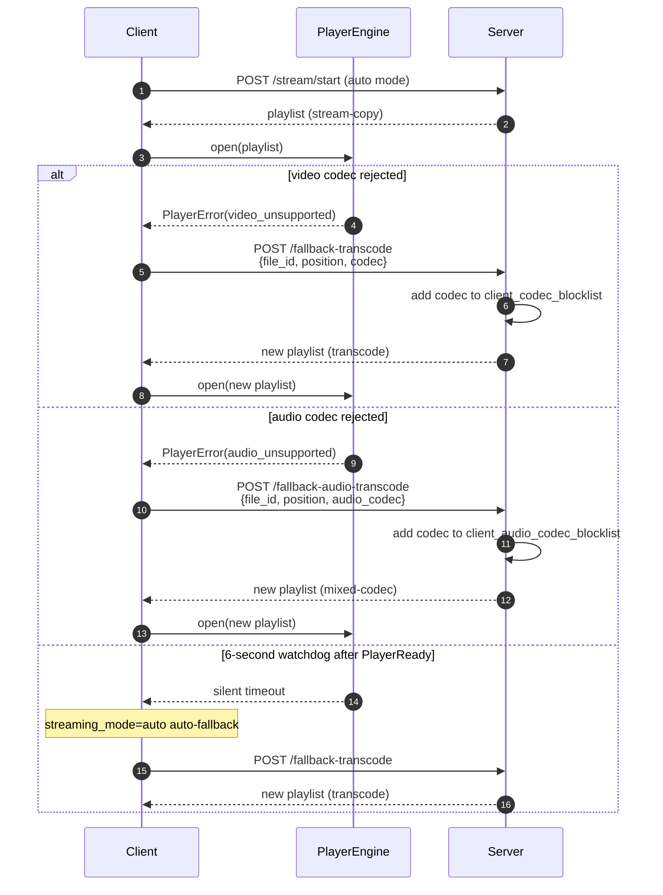
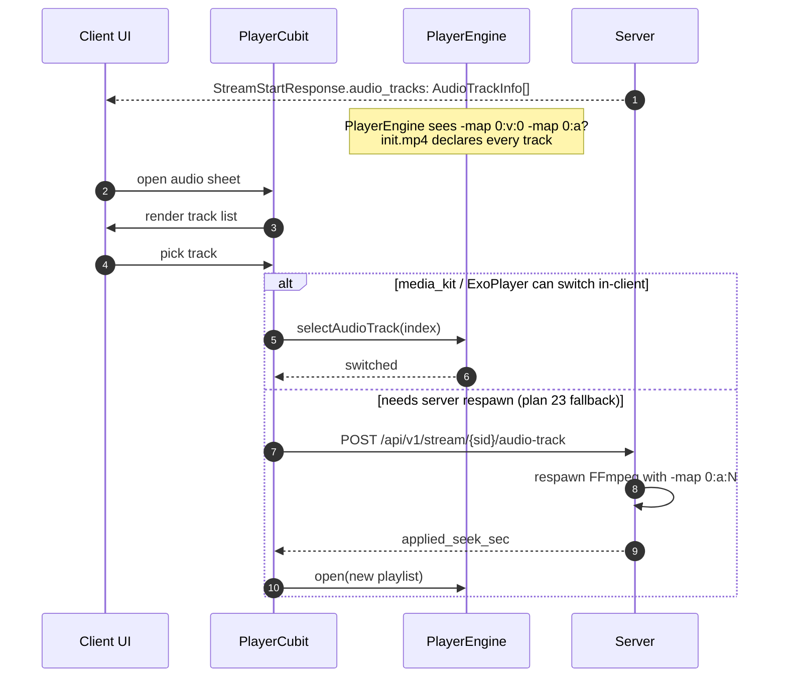
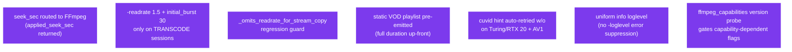

# 07 — Streaming Pipeline

> What happens between *user taps Play* and *frames appear on screen*. Server-side spawning logic + client-side playback.

---

## Happy path — LAN stream-copy

---

## Decision tree — mode selection

---

## Session state machine

---

## Client-side fallback escalation (plan 20 + 21)

---

## Multi-audio-track support (plan 22)

---

## §16 + §17 invariants (regression-guarded)

See [`docs/10_planning/16_streaming_resume_and_throttle_plan.md`](../../10_planning/16_streaming_resume_and_throttle_plan.md) + [`docs/10_planning/17_ffmpeg_diagnostics_and_m2_retry_plan.md`](../../10_planning/17_ffmpeg_diagnostics_and_m2_retry_plan.md).

---

## Known sharp edges (plan 11)

| Issue | Tracked in |
|---|---|
| Seek-restart edge cases | [plan 11](../../10_planning/11_streaming_pipeline_issues.md) |
| Tonemap timeout on long files | plan 11 |
| Zombie FFmpeg cleanup | plan 11 |
| Long-GOP game captures w/ stream-copy | resolved — `hls_time=10`, no `independent_segments` |
