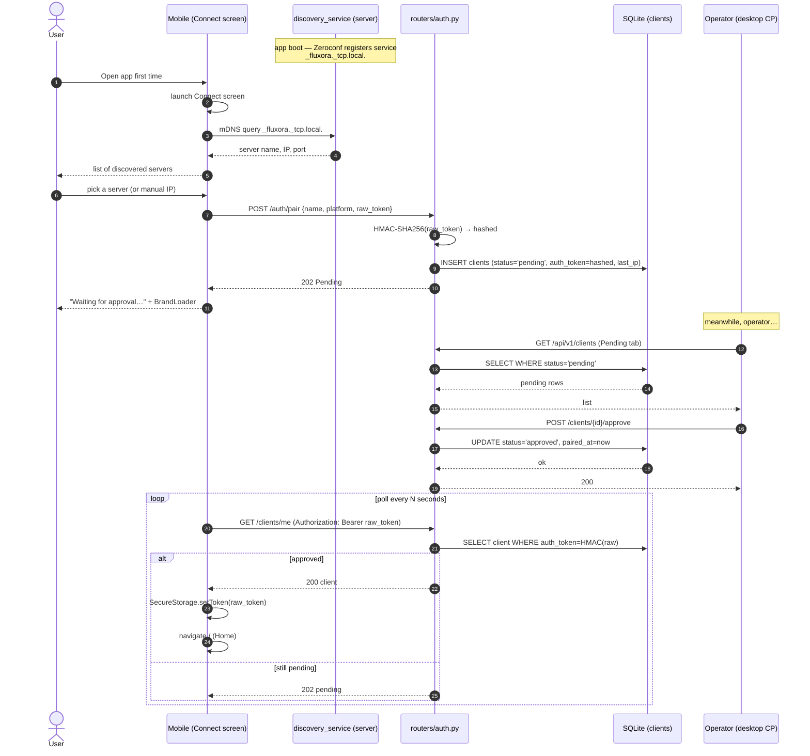
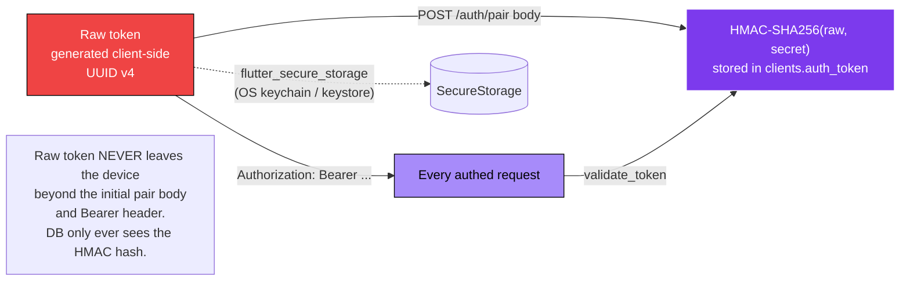
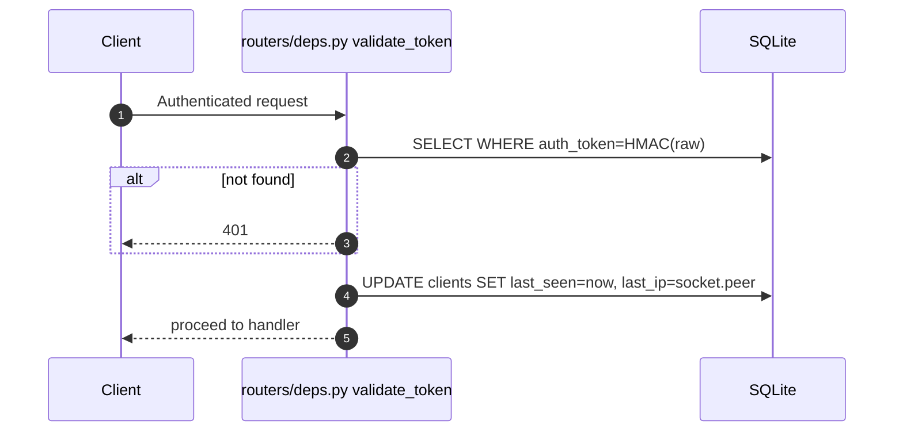
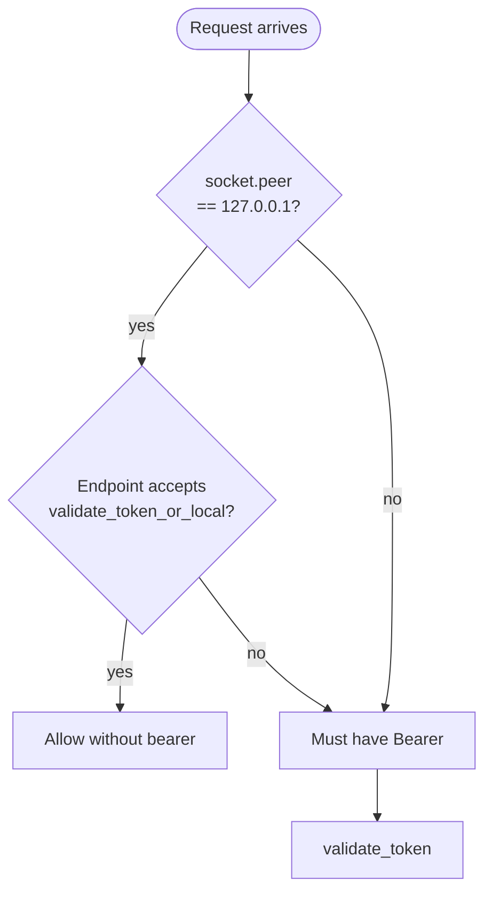
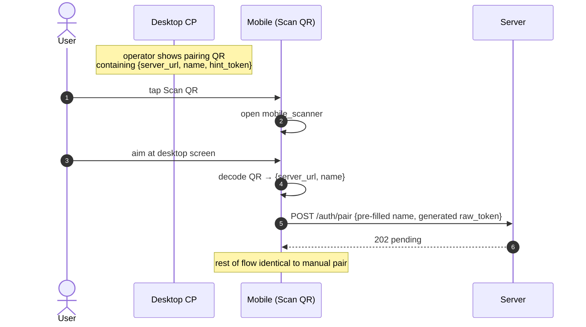
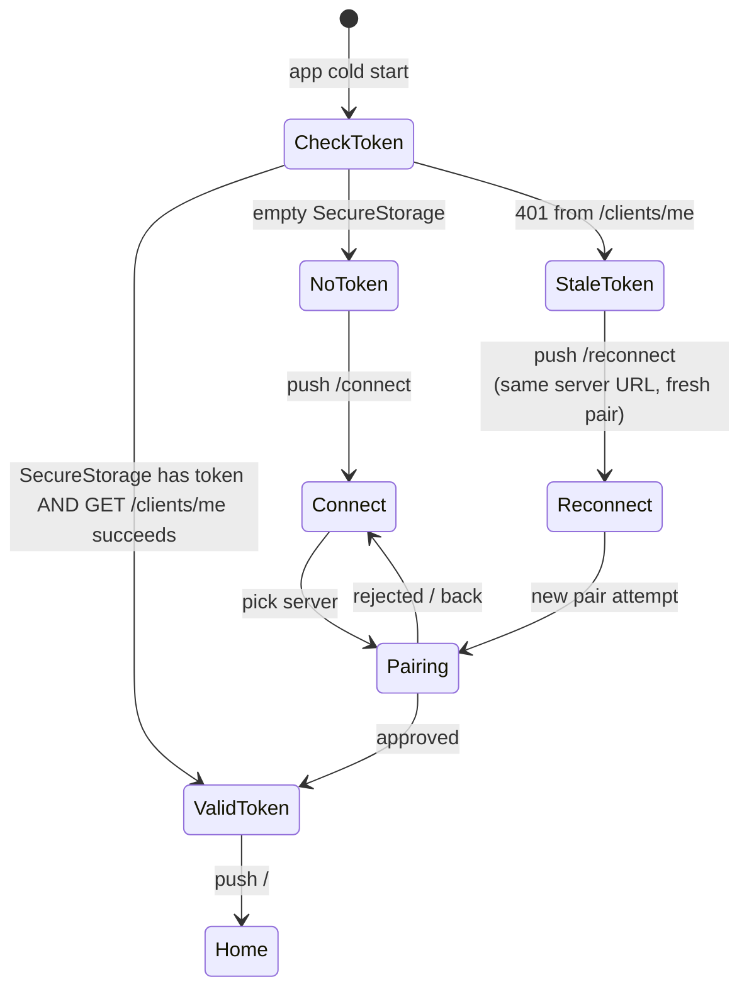

# 08 — Pairing & Auth Flow

> How a fresh device discovers the server, gets paired, and stays authenticated. Mobile flow shown; desktop control panel is local-bypass on the same host.

---

## Full pairing happy path

---

## Token storage + transport

> **Hard prohibition #13:** Bearer tokens are stored as HMAC-SHA256 hashes. No plaintext, no reversible encryption. See [CLAUDE.md](../../../CLAUDE.md).

---

## Heartbeat — last_seen + last_ip

Every authenticated request bumps `last_seen` and `last_ip`. Pre-migration-023, these were frozen at pair time — the operator's Clients screen used to show "never seen" for active clients.

---

## Local-bypass (desktop control panel on same host)

Some endpoints — `/info/*`, `/transcoding/*`, `/logs`, `/activity` — use `validate_token_or_local` so the operator's desktop control panel can hit them without pairing-as-itself. Remote callers still need a valid bearer.

---

## QR pairing (mobile-only convenience)

---

## Re-pair / reconnect

The Reconnect screen preserves the last server URL so the user doesn't have to rediscover.
