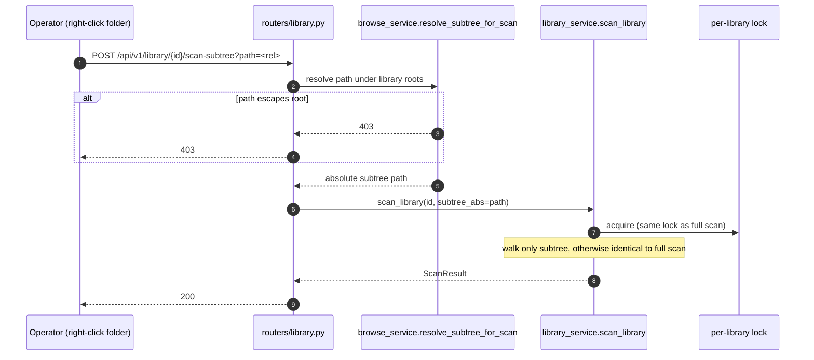
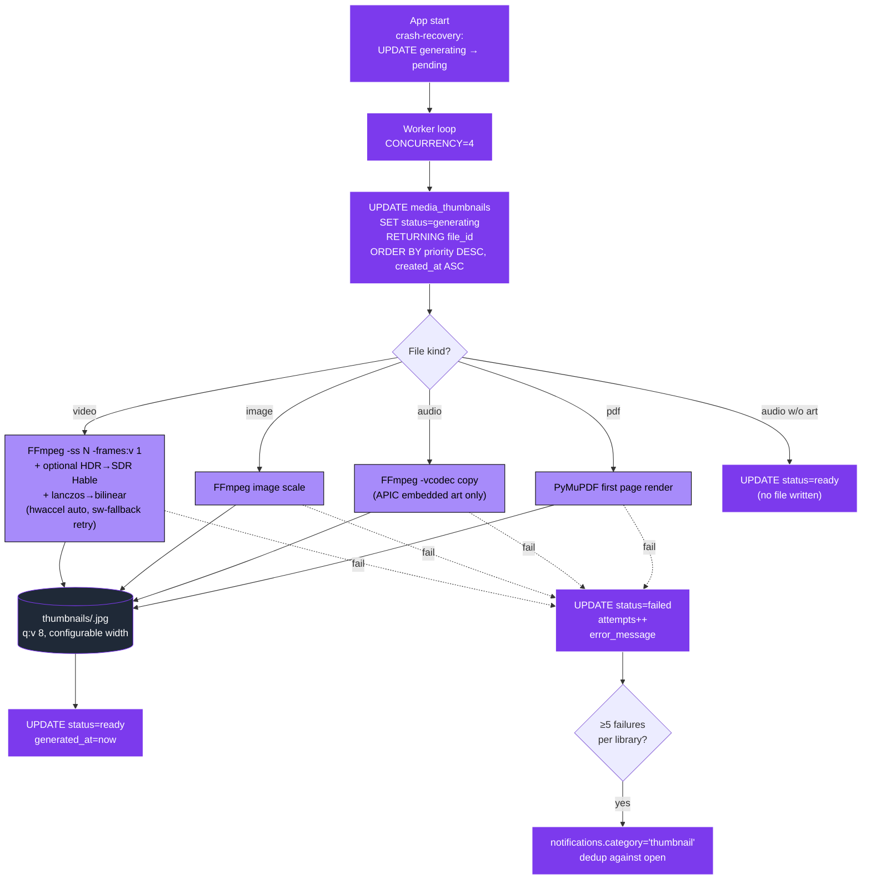
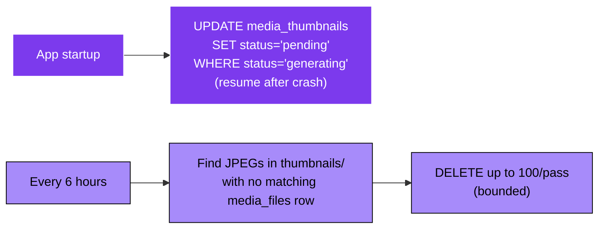
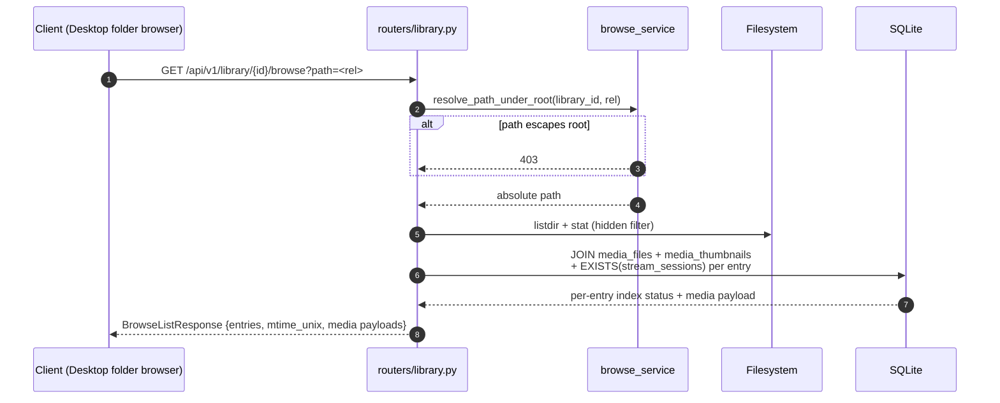
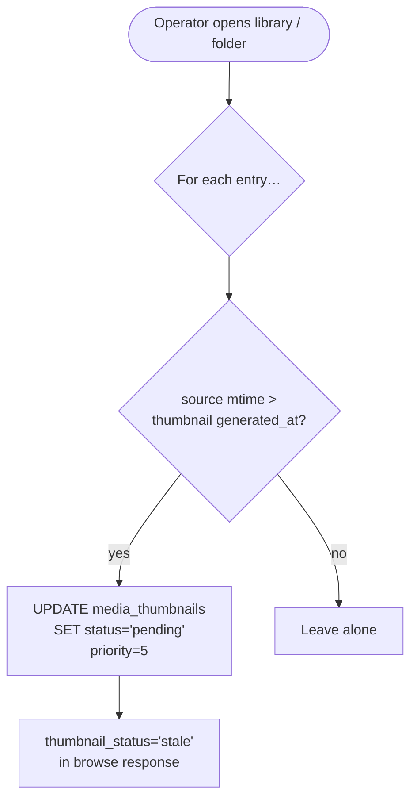

# 09 — Library Scan & Thumbnail Pipeline

> What happens when the operator adds a library or hits "Rescan". Walks the filesystem → probes media → enriches with TMDB → enqueues thumbnails.

---

## Library scan — top level

```mermaid
sequenceDiagram
  autonumber
  actor Op as Operator (Desktop CP)
  participant R as routers/library.py
  participant LS as library_service
  participant Lock as per-library asyncio lock
  participant FS as Filesystem walk
  participant FP as ffprobe subprocess
  participant DB as SQLite
  participant TW as thumbnail_worker
  participant TM as tmdb_service
  participant N as notification_service

  Op->>R: POST /api/v1/library/{id}/scan
  R->>LS: scan_library(id)
  LS->>Lock: acquire (one scan per library at a time)
  LS->>DB: read libraries.root_paths
  loop each root path
    LS->>FS: os.walk(root, followlinks=False)
    loop each supported file
      LS->>DB: INSERT OR IGNORE media_files (by path UNIQUE)
      alt newly inserted OR mtime newer than updated_at
        LS->>FP: ffprobe → width/height/codec/hdr_format/duration/audio_tracks
        FP-->>LS: probe JSON
        LS->>DB: UPDATE media_files SET width, height, codec_name, hdr_format, duration_sec, audio_tracks, updated_at
        LS->>TW: enqueue thumbnail (INSERT OR IGNORE media_thumbnails, priority=5)
        opt video w/ probable TMDB title AND tmdb_enabled
          LS->>TM: search(title, year)
          TM-->>LS: best match
          LS->>DB: UPDATE media_files SET tmdb_id, title, overview, poster_url
        end
      end
    end
  end
  LS->>DB: UPDATE libraries.last_scanned = now
  LS-->>R: stats {added, updated, skipped}
  R->>N: broadcast_event('library_changed')
  N-.->WS["/ws/notifications subscribers"]
  R-->>Op: 200 ScanResult
  Lock-->>LS: release
```

---

## Subtree scan (plan 28 Phase C)



The subtree path is routed under the **same per-library asyncio lock** as full scans — you can't full-scan and subtree-scan the same library concurrently.

---

## Thumbnail worker



### Worker priorities

| Priority | When |
|---|---|
| 10 | Operator opened the library — boost pending rows for that library |
| 10 | New single-file index (plan 28 Phase C) |
| 10 | Regenerate-single-thumbnail (plan 28 Phase C) |
| 5 | Default — scan enqueued |

---

## Endpoint surface

```mermaid
graph LR
  classDef get fill:#16a34a,stroke:#000,color:#fff
  classDef post fill:#7c3aed,stroke:#fff,color:#fff
  classDef del fill:#ef4444,stroke:#000,color:#fff

  GET1["GET /api/v1/files/{id}/thumbnail?v=&lt;unix&gt;<br/>1-day Cache-Control<br/>404 if not ready"]:::get

  POST1[POST /api/v1/library/{id}/scan<br/>full scan]:::post
  POST2[POST /api/v1/library/{id}/scan-subtree?path=]:::post
  POST3[POST /api/v1/library/{id}/index-file?path=]:::post
  POST4[POST /api/v1/library/{id}/regenerate-thumbnails<br/>resets all rows]:::post
  POST5[POST /api/v1/files/{id}/regenerate-thumbnail<br/>resets one row]:::post

  GET2[GET /api/v1/library/{id}/browse?path=]:::get
  GET3[GET /api/v1/library/{id}/folder-size?path=]:::get
```

`?v=<unix>` is the cache-buster — set to `media_thumbnails.generated_at` so a regenerate invalidates Flutter's `cached_network_image` + browser caches automatically.

---

## Orphan-JPEG sweep + crash recovery



---

## Browse endpoint (plan 28)



The browse endpoint does NOT enqueue new thumbnails — only `scan` / `scan-subtree` / `index-file` insert into `media_thumbnails`. Hidden files are returned but flagged so the desktop can choose to filter them.

---

## Stale-thumbnail detection



Source-modified files are auto-re-queued for thumbnail regen. The browse response reports `thumbnail_status='stale'` so the client can show a refresh hint.
