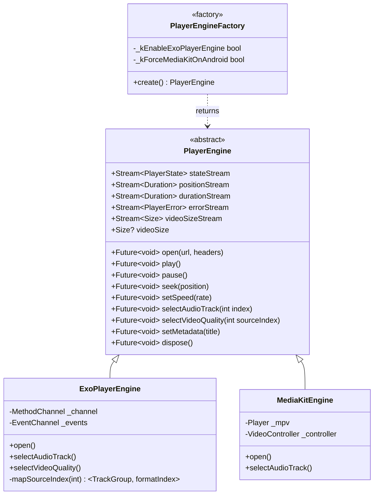
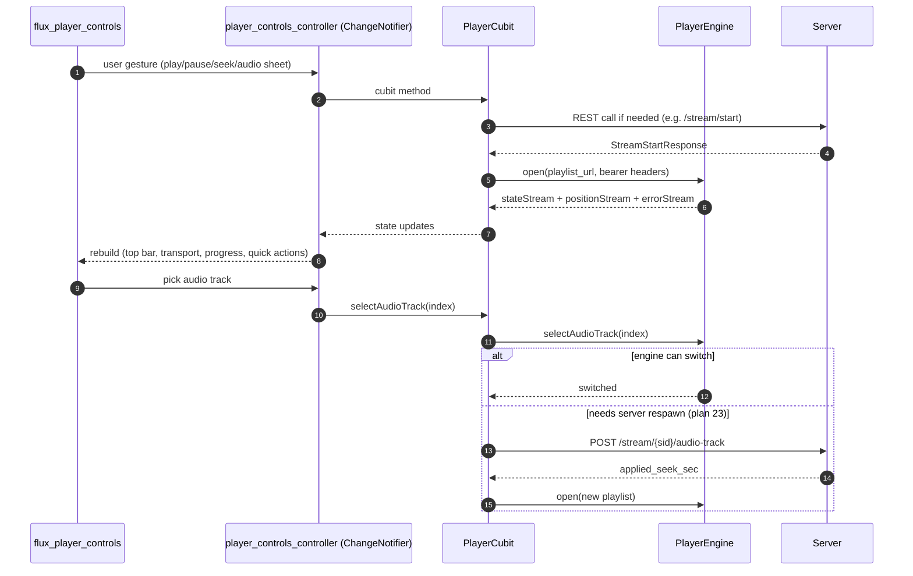
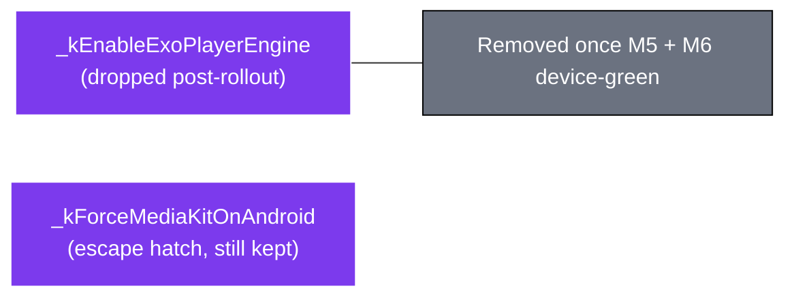

# 10 — Player Engines

> Plan 24's `PlayerEngine` abstraction. Lets mobile use **ExoPlayer (Media3)** on Android and **media_kit (libmpv)** elsewhere from a single Dart cubit + UI.

---

## Class hierarchy



All three live in `packages/fluxora_core/lib/player/`.

---

## Platform routing

```mermaid
flowchart TB
  classDef android fill:#16a34a,stroke:#000,color:#fff
  classDef desktop fill:#3b82f6,stroke:#000,color:#fff
  classDef ios fill:#a78bfa,stroke:#000,color:#fff
  classDef escape fill:#f59e0b,stroke:#000,color:#000

  Start([PlayerEngineFactory.create]) --> Q1{Platform.isAndroid?}
  Q1 -- yes --> Q2{_kForceMediaKitOnAndroid?<br/>(operator escape hatch)}
  Q2 -- no default --> Exo["ExoPlayerEngine<br/>Media3 1.10.1 + Tonemap"]:::android
  Q2 -- yes --> MK1[MediaKitEngine on Android]:::escape
  Q1 -- no --> Q3{Platform.isIOS?}
  Q3 -- yes --> MK2[MediaKitEngine via libmpv-ios]:::ios
  Q3 -- no --> MK3[MediaKitEngine on Win/macOS/Linux]:::desktop
```

The desktop control panel does **not** instantiate a player engine — it has no playback surface. The mobile app instantiates exactly one engine per `PlayerCubit` lifecycle.

---

## ExoPlayer engine — Kotlin side

```mermaid
graph TB
  classDef kotlin fill:#7c3aed,stroke:#fff,color:#fff
  classDef m3 fill:#a78bfa,stroke:#000,color:#000
  classDef chan fill:#fde68a,stroke:#000,color:#000

  Chan[MethodChannel<br/>dev.marshalx.fluxora/exo_player]:::chan
  Events[EventChannel<br/>events]:::chan

  Chan --> Plugin[ExoPlayerPlugin.kt]:::kotlin
  Events --> Plugin

  Plugin --> Build[Build ExoPlayer instance]:::kotlin
  Build --> RF[TonemappingRenderersFactory<br/>(extends DefaultRenderersFactory)]:::m3
  RF --> VR["MediaCodecVideoRenderer subclass<br/>KEY_COLOR_TRANSFER_REQUEST = SDR (API 33+)"]:::m3

  Plugin --> Bearer[Inject Authorization header<br/>via DefaultHttpDataSource.Factory<br/>(no token logged)]:::kotlin

  Plugin --> Listener[Player.Listener]:::m3
  Listener -- onTracksChanged --> Map[Source-index → TrackGroup + formatIndex]
  Listener -- onVideoSizeChanged --> Size[videoSize w/ PAR baked in]
  Listener -- onPlayerError --> Err[Forward to errorStream]

  Plugin --> MS[Media3 MediaSessionService<br/>lockscreen / notification / BT transport]:::m3
  Plugin --> AF[AudioFocus + BecomingNoisyReceiver<br/>auto-pause on headset pull]:::kotlin

  Plugin --> Ticker[250ms position ticker → events]:::kotlin
  Plugin --> NSC[network_security_config.xml<br/>cleartext for LAN<br/>HTTPS-only for prod domain]:::kotlin
```

---

## Engine capability matrix

| Capability | ExoPlayerEngine | MediaKitEngine |
|---|---|---|
| HDR → SDR tonemap (client) | Yes — `TonemappingRenderersFactory`, API 33+ | No (server `?tonemap=true` fallback) |
| Multi-audio in-client switch | Yes | Yes |
| Multi-video-quality in-client switch | Yes — `(TrackGroup, formatIndex)` map | Limited |
| Bearer header injection | Yes — `DefaultHttpDataSource.Factory` | Yes — `media_kit` httpHeaders |
| Lockscreen / Bluetooth transport | Yes — Media3 `MediaSessionService` | No |
| Audio focus / becoming-noisy | Yes | Manual |
| LAN cleartext | Yes — `network_security_config.xml` carve-out | Yes — libmpv ignores Android policy |
| Anamorphic PAR | Yes — baked into `videoSize` | Yes |
| Pinch zoom / fit-fill-stretch | Implemented in Flutter via raw `Listener` (both) | Same |

---

## Mobile player UI ↔ engine wiring



---

## Decision flags



See [`docs/10_planning/24_player_audio_reliability_plan.md`](../../10_planning/24_player_audio_reliability_plan.md) for milestone status. M5 (multi-audio device smoke) + M6 (HDR + tonemap) require operator device testing; once they're green, `_kForceMediaKitOnAndroid` gets deleted and the plan archives.
