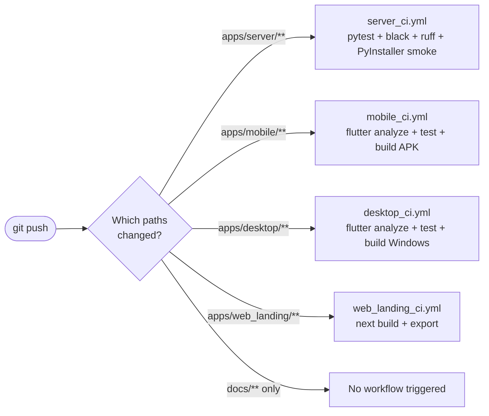
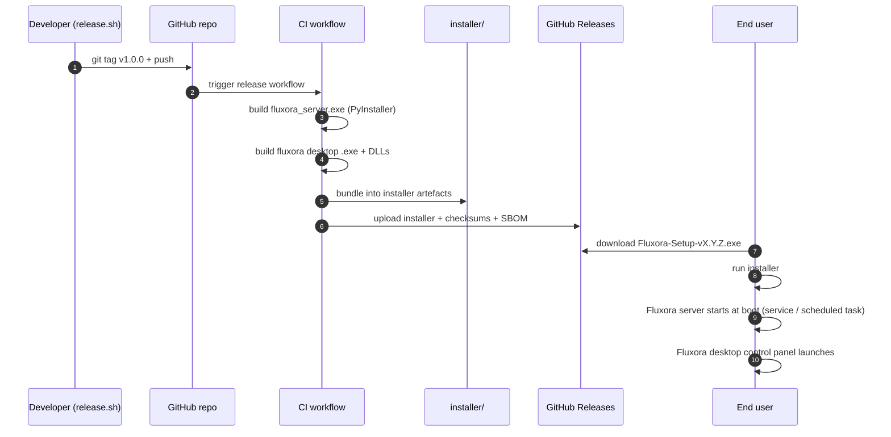
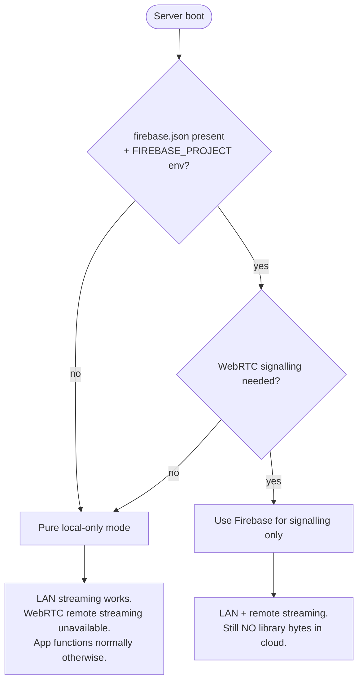

# 11 — Deployment & Distribution

> How code in this repo becomes a running app on a user's machine or phone. CI pipelines, build outputs, install paths.

---

## Build matrix

```mermaid
graph TB
  classDef src fill:#7c3aed,stroke:#fff,color:#fff
  classDef ci fill:#a78bfa,stroke:#000,color:#000
  classDef out fill:#16a34a,stroke:#000,color:#fff
  classDef dist fill:#f59e0b,stroke:#000,color:#000

  subgraph Sources
    SrvSrc[apps/server/]:::src
    MobSrc[apps/mobile/]:::src
    DskSrc[apps/desktop/]:::src
    WebSrc[apps/web_landing/]:::src
  end

  subgraph CI[".github/workflows/ (path-scoped)"]
    direction LR
    SrvCI[server_ci.yml]:::ci
    MobCI[mobile_ci.yml]:::ci
    DskCI[desktop_ci.yml]:::ci
    WebCI[web_landing_ci.yml]:::ci
  end

  subgraph Scripts["scripts/"]
    BS1[build_server.ps1]
    BS2[build_server.sh]
    BM[build_mobile.sh]
    BD[build_desktop.sh]
    Rel[release.sh]
  end

  subgraph Outputs
    Exe[fluxora_server.exe<br/>PyInstaller]:::out
    SrvBin[fluxora_server binary<br/>Linux / macOS]:::out
    Apk[app-release.apk]:::out
    Ipa[Runner.ipa]:::out
    DskWin[fluxora.exe<br/>+ flutter_windows.dll<br/>+ resources/]:::out
    DskMac[Fluxora.app]:::out
    DskLnx[fluxora binary]:::out
    WebOut[out/<br/>static export]:::out
  end

  subgraph Distribution
    Installer[installer/<br/>Windows installer artefacts]:::dist
    GHRel[GitHub Releases]:::dist
    CFPages[fluxora.marshalx.dev<br/>Cloudflare Pages]:::dist
    PlayStore[Play Store<br/>(future)]:::dist
    AppStore[App Store<br/>(future)]:::dist
  end

  SrvSrc --> SrvCI --> BS1 --> Exe --> Installer --> GHRel
  SrvSrc --> BS2 --> SrvBin --> GHRel
  MobSrc --> MobCI --> BM
  BM --> Apk --> PlayStore
  BM --> Ipa --> AppStore
  DskSrc --> DskCI --> BD
  BD --> DskWin --> Installer
  BD --> DskMac
  BD --> DskLnx
  WebSrc --> WebCI --> WebOut --> CFPages
  GHRel -.->  Rel
```

---

## Path-scoped CI



A docs-only push leaves all CI workflows idle — they're path-filtered. See `docs/12_guidelines/05_gh_cli_usage.md` for the triage pattern, or invoke the `/ci-status` skill.

---

## Windows installer flow



The installer plan is currently **proposed** — see [`docs/10_planning/06_installer_plan.md`](../../10_planning/06_installer_plan.md).

---

## What ships where

| Artefact | Where it lives at runtime | Notes |
|---|---|---|
| `fluxora_server.exe` | Operator chosen install dir | PyInstaller one-file; ffmpeg + ffprobe shipped or auto-detected |
| Desktop control panel | Operator install dir | Frameless Windows runner; AppUserModelID = `Fluxora.Desktop` |
| `~/.fluxora/fluxora.db` | User home | SQLite, WAL mode |
| `~/.fluxora/thumbnails/` | User home | JPEG cache |
| `~/.fluxora/transcoded/` (or operator-configured) | Operator's chosen `transcode_cache_root` | AV1/VP9 → H.264 sidecars |
| Mobile app | Phone | Bearer token in `flutter_secure_storage` |
| Web landing | `fluxora.marshalx.dev` | Cloudflare Pages, static export |

---

## Firebase usage gate



> **Constraint:** Library bytes never touch Firebase. Signalling only — and even that is optional. v1 ships as fully self-hosted with Firebase as Phase 3+ opt-in.

---

## Secrets at build time

| Secret | Where it's injected | Never in git |
|---|---|---|
| `google-services.json` | `apps/mobile/android/app/` at build | `.gitignore` |
| `GoogleService-Info.plist` | `apps/mobile/ios/Runner/` at build | `.gitignore` |
| `config.json` (dart-define) | desktop + mobile build args | `.gitignore` |
| `.env` (server) | server install dir or env vars | `.gitignore` |
| `FLUXORA_LICENSE_SECRET` | server env | License HMAC secret |
| `TMDB_API_KEY` | server env | Optional — server falls through if unset |
| `POLAR_WEBHOOK_SECRET` | server env | Signature verify |


---

## Releases — checklist (cross-reference)

| Step | Where it lives |
|---|---|
| Update version in pubspec / pyproject | manual |
| Tag release | `scripts/release.sh` |
| Build artefacts | CI workflows |
| Publish notes | GitHub Release |
| Ship readiness checks | [`docs/10_planning/05_ship_readiness.md`](../../10_planning/05_ship_readiness.md) |
